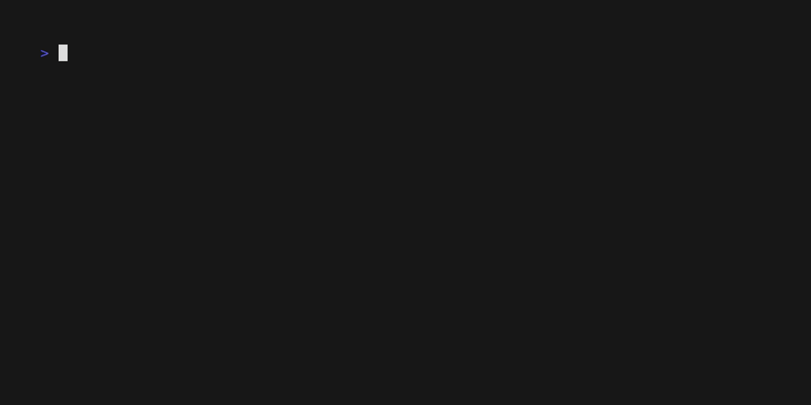

[](https://forms.gle/QrFAaXgbLnsxywhA7)

# project name

<div align="center">


Lorem ipsum dolor sit amet, consectetur adipiscing elit. Vestibulum euismod tellus at blandit tempor.




</div>

# Table of contents

- [introduction](#introduction)
- [installation](#installation)
- [getting started](#getting-started)
- [setup](#setup)
  - [package manager](#package-manager)
- [commands](#commands)
- [reference](#reference)

## introduction

TBD

## installation

TBD

## getting started

TBD

## setup

### package manager

install `asdf` package manager first.

```sh
# download asdf binary from github release page
# https://github.com/asdf-vm/asdf/releases
```

check plugins.

```sh
asdf plugin list
```

add a plugin for a targeted side project.

```sh
asdf plugin add [language]
asdf install [language]
```

set it.

```sh
asdf set [language] [version]
asdf reshim [language]
```

check it.

```sh
asdf current [language]
```

## reference

TBD
